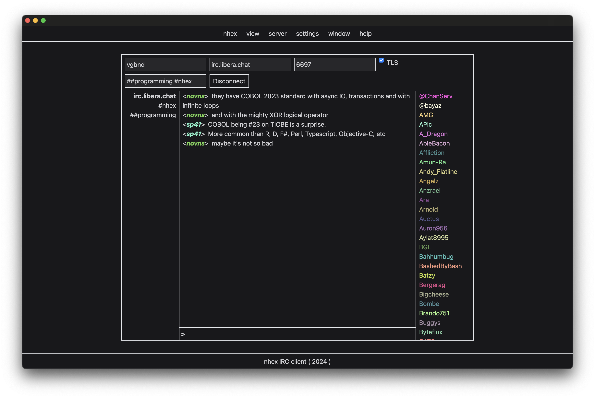

# nhex

A next-generation IRC client inspired by [HexChat](https://hexchat.github.io/).



**[Contributors](#contributing) needed & wanted!** Apply... by submitting a PR!

Chat with us at [#nhex on irc.libera.chat](https://web.libera.chat/?channel=#nhex).

## Pre-requisites

* [Tauri pre-requisites](https://tauri.app/v1/guides/getting-started/prerequisites/) ([node.js](https://nodejs.org/en/download) & [rust](https://www.rust-lang.org/tools/install))

#### Recommended IDE Setup

- [VS Code](https://code.visualstudio.com/) + [Tauri](https://marketplace.visualstudio.com/items?itemName=tauri-apps.tauri-vscode) + [rust-analyzer](https://marketplace.visualstudio.com/items?itemName=rust-lang.rust-analyzer)

## Developing

```shell
$ npm install
$ npm run tauri dev
```

## Building

```shell
$ npm run tauri build
```

## Contributing

Remember to [build **successfully**](#building) before commiting changes.

### Development Guidelines

1. This is **not** a source-level port! This is an entirely new application wholly _inspired by_ the best (IMHO) GUI IRC client that ever existed. RIP HexChat.
   * In fact, source introspection is *prohibited* for contributors! Black-box behavioral inspection of HexChat (e.g. use it, see how it works, replicate the behavior) is the only allowed form of HexChat inspection.
1. **Do not** share state between components! This is *paramount* for future maintainability. If one component (`A`) must affect the state of another (`B`), we use the actor model: `A` sends the appropriate message on the event system which `B` listens for and updates its internal state accordingly.
1. Lift out of Rust _early_ & _often_. So, as long as it is reasonable & performant* to do so, implementation should prefer to live in the frontend not the backend.
    * \* It nearly _always_ will be: this is an IRC client, not a 120 FPS video game.
    * This contributes directly to the [long-term goal of extracting the UX into a web app!](https://github.com/nhexirc/client/issues/17)
1. 7 is a theme in design for nhex: include as subtly as possible! (["Hexa"](https://en.wikipedia.org/wiki/Numeral_prefix#Table_of_number_prefixes_in_English) is a prefix for "six", plus one, hence 7.)

## Contributors

* [gnprwx](https://github.com/gnprwx)
* [terrablue](https://github.com/terrablue)
* hmw[at] (irc.libera.chat)
* InPhase (irc.libera.chat)
* systemfault (irc.libera.chat)
* PantelicGR (irc.libera.chat)

... and everyone else in ##programming & elsewhere who chimed in on naming or anything else! Y'all rock ❤️
