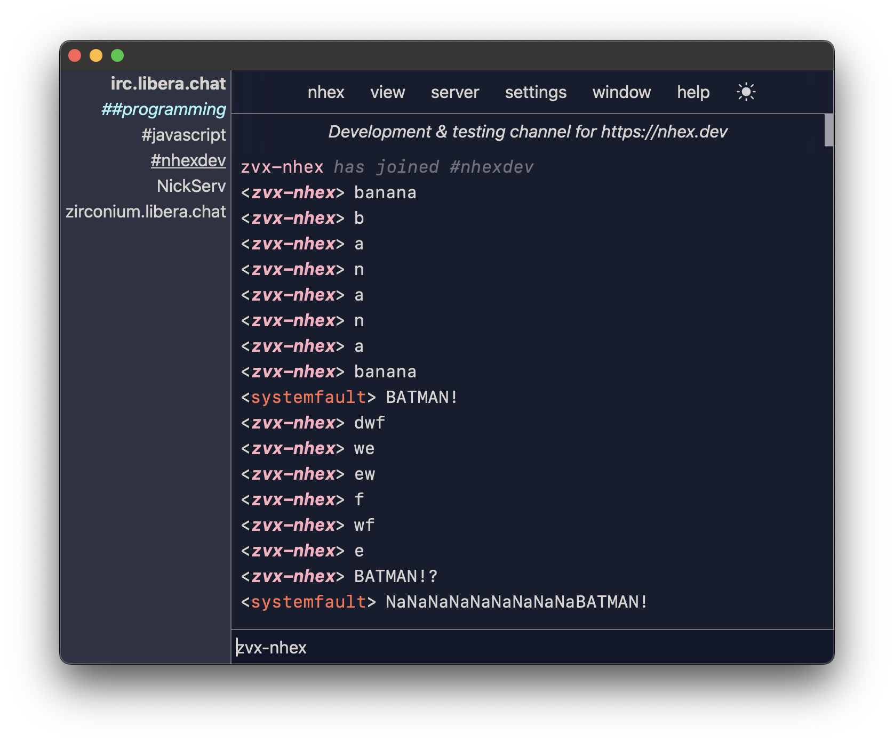
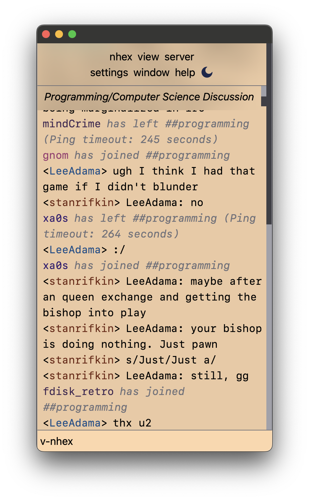

# nhex

A next-generation IRC client inspired by [HexChat](https://hexchat.github.io/).


_Jump right to [the downloads](https://github.com/nhexirc/nhex/releases/latest) or [the documentation](https://nhex.dev/docs/)._

Pronounced "_nex_" (the "_h_" is silent).

**[Contributors](#contributing) needed & wanted!** Apply... by submitting a PR! [The 1.0 milestone](https://github.com/nhexirc/client/milestone/1) is a great place to start looking for tasks with immediate impact.

Chat with us at [#nhex on irc.libera.chat](https://web.libera.chat/?channel=#nhex).
# Screenshots

## Normal views (Day/Night theme)


## Mobile views (Medium and Small)



# Downloading

See the [latest release](https://github.com/nhexirc/nhex/releases/latest) to download installers for Debian-based Linux distros, Windows & Mac OS.

# Using

See [the documentation](https://nhex.dev/docs/) for full usage details.

# Developing

## Prerequisites

* [Tauri pre-requisites](https://tauri.app/v1/guides/getting-started/prerequisites/) ([node.js](https://nodejs.org/en/download) & [rust](https://www.rust-lang.org/tools/install))

#### Recommended IDE Setup

- [VS Code](https://code.visualstudio.com/) + [Tauri](https://marketplace.visualstudio.com/items?itemName=tauri-apps.tauri-vscode) + [rust-analyzer](https://marketplace.visualstudio.com/items?itemName=rust-lang.rust-analyzer)

```shell
$ npm install
$ npm run tauri dev
```

## Building

[](https://github.com/nhexirc/nhex/actions/workflows/build_check.yml)

### Locally

```shell
$ npm run tauri build
```

### In CI/CD

You can manually trigger builds by prepending `dev-build/` to any branch name.

All Pull Requests will automatically trigger the development pipeline.

The development pipeline will create a draft pre[release](https://github.com/nhexirc/nhex/releases) with your assets attached.

## Contributing

### Development Guidelines

1. This is **not** a source-level port! This is an entirely new application wholly _inspired by_ the best (IMHO) GUI IRC client that ever existed. RIP HexChat.
   * In fact, source introspection is *prohibited* for contributors! Black-box behavioral inspection of HexChat (e.g. use it, see how it works, replicate the behavior) is the only allowed form of HexChat inspection.
1. **Do not** share state between components! This is *paramount* for future maintainability. If one component (`A`) must affect the state of another (`B`), we use the actor model: `A` sends the appropriate message on the event system which `B` listens for and updates its internal state accordingly.
1. Lift out of Rust _early_ & _often_. So, as long as it is reasonable & performant* to do so, implementation should prefer to live in the frontend not the backend.
    * \* It nearly _always_ will be: this is an IRC client, not a 120 FPS video game.
    * This contributes directly to the [long-term goal of extracting the UX into a web app!](https://github.com/nhexirc/client/issues/17)
1. 7 is a theme in design for nhex: include as subtly as possible! (["Hexa"](https://en.wikipedia.org/wiki/Numeral_prefix#Table_of_number_prefixes_in_English) is a prefix for "six", plus one, hence 7.)

### Creating a release

Use the included [`create-release` script](/packages/client/scripts/create-release) to prepare the release:

```shell
$ ./scripts/create-release major
```

Where `major` is the release type as supported by [`semver.inc()`](https://www.npmjs.com/packages/semver). If not provided, the default value for this argument is `patch`.

The script will increment the appropriate `version` field in all necessary metadata files and provide a set of `git` CLI invocations to commit, tag & push the release.

Any tag beginning with `v` will trigger the release pipeline, and this script suggests just a tag to be used.

The resulting [release](https://github.com/nhexirc/nhex/releases) will be a draft - not yet visible to the public - until you publish it. When you do, please include a short high-level description of the release and use GitHub's "Create Release Notes" functionality to generate a changelog.

## Contributors

In addition to our amazing team (which is growing fast!) the list of incredible folks who have contributed ideas, advice, suggestions, etc. on irc.libera.chat has already grown too numerous to easily keep track of here!

The response has been overwhelming, so a huge thanks to all of those who did contribute. Y'all rock! 🤘❤️

### Special Mention

Logo design by `hmw[at]`, with additional ideation from `InPhase` & `systemfault` (all of [libera](https://libera.chat/)).

## License

`nhex` is multi-licensed, the details of which can be found in the [DEP5](https://reuse.software/spec/#dep5) file [.reuse/dep5](./.reuse/dep5).

At a high level, the React-based frontend is licensed under the [MIT]([./packages/client/LICENSES/MIT.txt) license & the Rust-based backend under the [Mozilla Public License, version 2.0](./packages/client/LICENSES/MPL-2.0.txt).

You agree for any contributions submitted by you for inclusion into nhex to be redistributed under these licenses.

License text can be found in [LICENSES](./packages/client/LICENSES/).
