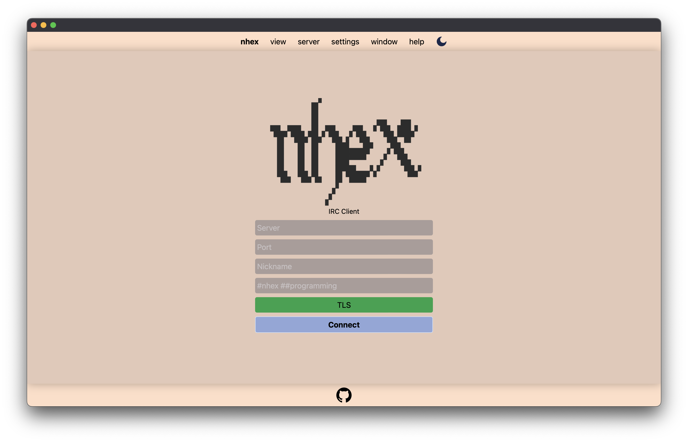
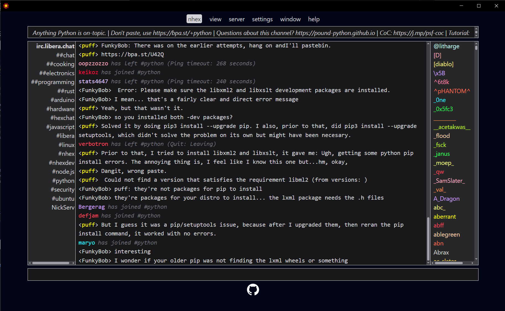

# nhex

A next-generation IRC client inspired by [HexChat](https://hexchat.github.io/).




Pronounced "_nex_" (the "_h_" is silent).

**[Contributors](#contributing) needed & wanted!** Apply... by submitting a PR! [The 1.0 milestone](https://github.com/nhexirc/client/milestone/1) is a great place to start looking for tasks with immediate impact.

Chat with us at [#nhex on irc.libera.chat](https://web.libera.chat/?channel=#nhex).

## Pre-requisites

* [Tauri pre-requisites](https://tauri.app/v1/guides/getting-started/prerequisites/) ([node.js](https://nodejs.org/en/download) & [rust](https://www.rust-lang.org/tools/install))

#### Recommended IDE Setup

- [VS Code](https://code.visualstudio.com/) + [Tauri](https://marketplace.visualstudio.com/items?itemName=tauri-apps.tauri-vscode) + [rust-analyzer](https://marketplace.visualstudio.com/items?itemName=rust-lang.rust-analyzer)

# Developing

```shell
$ npm install
$ npm run tauri dev
```

## Building

### Locally

```shell
$ npm run tauri build
```

### In CI/CD

You can manually trigger builds by prepending `dev-build/` to any branch name.

All Pull Requests will automatically trigger the development pipeline.

The development pipeline will create a draft pre[release](https://github.com/nhexirc/nhex/releases) with your assets attached.

## Contributing

### Development Guidelines

1. This is **not** a source-level port! This is an entirely new application wholly _inspired by_ the best (IMHO) GUI IRC client that ever existed. RIP HexChat.
   * In fact, source introspection is *prohibited* for contributors! Black-box behavioral inspection of HexChat (e.g. use it, see how it works, replicate the behavior) is the only allowed form of HexChat inspection.
1. **Do not** share state between components! This is *paramount* for future maintainability. If one component (`A`) must affect the state of another (`B`), we use the actor model: `A` sends the appropriate message on the event system which `B` listens for and updates its internal state accordingly.
1. Lift out of Rust _early_ & _often_. So, as long as it is reasonable & performant* to do so, implementation should prefer to live in the frontend not the backend.
    * \* It nearly _always_ will be: this is an IRC client, not a 120 FPS video game.
    * This contributes directly to the [long-term goal of extracting the UX into a web app!](https://github.com/nhexirc/client/issues/17)
1. 7 is a theme in design for nhex: include as subtly as possible! (["Hexa"](https://en.wikipedia.org/wiki/Numeral_prefix#Table_of_number_prefixes_in_English) is a prefix for "six", plus one, hence 7.)

### Creating a release

Bump the version number in a separate commit. It must be changed in three places: [package.json](https://github.com/nhexirc/nhex/blob/f74ff9810af2007162e98e7cd84f2f6347662407/package.json#L4), [src-tauri/Cargo.toml](https://github.com/nhexirc/nhex/blob/f74ff9810af2007162e98e7cd84f2f6347662407/src-tauri/Cargo.toml#L3) and [src-tauri/tauri.conf.json](https://github.com/nhexirc/nhex/blob/f74ff9810af2007162e98e7cd84f2f6347662407/src-tauri/tauri.conf.json#L10)
 
Tags beginning with `v` will automatically trigger the release pipeline: tag the version-bump commit accordingly & push.

The resulting [release](https://github.com/nhexirc/nhex/releases) will be a draft, not yet visible to the public, until you publish it.

## Contributors

In addition to our amazing team (which is growing fast!) the list of incredible folks who have contributed ideas, advice, suggestions, etc. on irc.libera.chat has already grown too numerous to easily keep track of here (and the project is less than a week old)!

The response has been overwhelming, so a huge thanks to all of those who did contribute. Y'all rock! 🤘❤️
