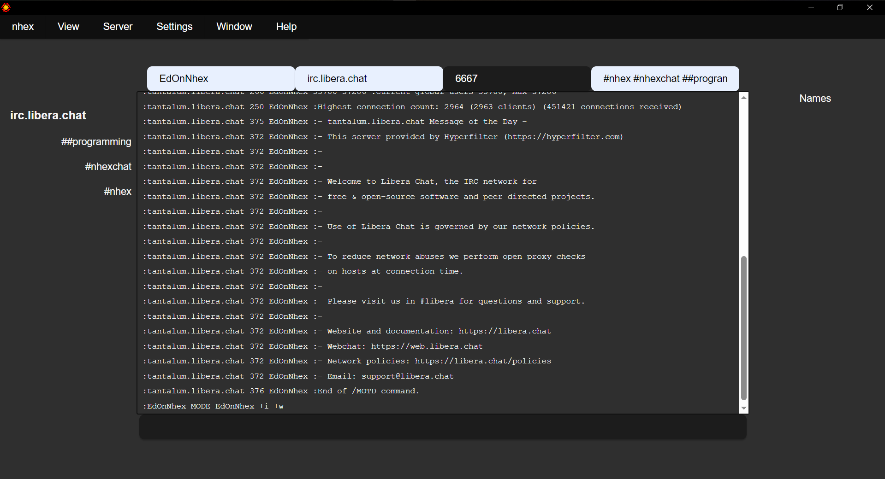

# nhex

A next-generation IRC client inspired by [HexChat](https://hexchat.github.io/)



## Status

This is currently in proof-of-concept phase, striving toward minimum-viable-product. As of this writing the project is less than 48 hours old, so please excuse the mess.

_Technically_ it's already at MVP in as much as it is _usable_ as a client, though _just barely_.

**Contributors needed & wanted!** Apply... by submitting a PR!

## Recommended IDE Setup

- [VS Code](https://code.visualstudio.com/) + [Tauri](https://marketplace.visualstudio.com/items?itemName=tauri-apps.tauri-vscode) + [rust-analyzer](https://marketplace.visualstudio.com/items?itemName=rust-lang.rust-analyzer)

## Pre-requisites

* [node.js](https://nodejs.org/en/download)
* [rust](https://www.rust-lang.org/tools/install)
* [Tauri pre-requisites](https://tauri.app/v1/guides/getting-started/prerequisites/)

## Developing

```shell
$ npm install
$ npm run tauri dev
```

## Building

```shell
$ npm run tauri build
```

## Contributing

### Discuss

[#nhex on irc.libera.chat](https://web.libera.chat/?channel=#nhex)

### Development Guidelines

1. This is **not** a source-level port! This is an entirely new application wholly _inspired by_ the best (IMHO) GUI IRC client that ever existed. RIP HexChat.
   * In fact, source introspection is *prohibited* for contributors! Black-box behavioral inspection of HexChat (e.g. use it, see how it works, replicate the behavior) is the only allowed form of HexChat inspection.
1. **Do not** share state between components! This is *paramount* for future maintainability. If one component (`A`) must affect the state of another (`B`), we use the actor model: `A` sends the appropriate message on the event system which `B` listens for and updates its internal state accordingly.
1. For UX components: use [shadcn/ui](https://ui.shadcn.com/) whenever possible and *always* [manually install](https://ui.shadcn.com/docs/installation/manual).
1. Lift out of Rust _early_ & _often_. So, as long as it is reasonable & performant* to do so, implementation should prefer to live in the frontend not the backend.
    * \* It nearly _always_ will be: this is an IRC client, not a 120 FPS video game.
1. 7 is a theme in design for nhex: include as subtly as possible! (["Hexa"](https://en.wikipedia.org/wiki/Numeral_prefix#Table_of_number_prefixes_in_English) is a prefix for "six", plus one, hence 7.)

### Contributors

Not even two days old and already gaining contributors! Y'all rock ❤️

* hmw[at] (irc.libera.chat) -- Logo design
* InPhase (irc.libera.chat) -- Naming, logo design
* systemfault (irc.libera.chat) -- Logo design
* blueagain (irc.libera.chat) -- Naming, Community
* PantelicGR (irc.libera.chat) -- Copy editing

... and everyone else in ##programming & elsewhere who chimed in on naming or anything else!
