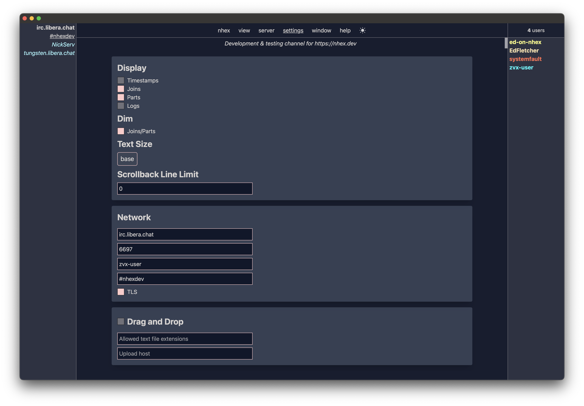

Not all available user settings are yet configurable with the user interface. See ["Example Code"](#example-code) below for the complete settings specification.



### Message Display

* **Show timestamps**: displays a timestamp preceding each message.
* **Show joins**: show an informational message in the channel each time a user joins.
* **Show parts**: show an informational message in the channel each time a user parts (or quits).
* **Dim joins & parts**: dim the join & part information messages.
* **Font size**: set the font size for messages.
* **Channel scrollback line limit**: the maximum amount of messages lines - per channel - to keep in memory.

### Network

* **Server**: the server hostname or IP address to connect to. 
* **Port**: the server's port number to connect to. 
* **Nickname**: your nickname. 
* **Channels**: a space-separated list of channels to automatically join after successfully connecting.
  * If you include a command that will authenticate your user after connecting in `Network.connectCommands` (e.g. `/msg NickServ identify ...`), set `Network.expectLoggedInAfterConnectCommands` to `true` to ensure that these channels are _not_ joined _until_ you have successfully authenticated. On servers that do not apply the user's cloak until after authentication, this will ensure you do not join channels without your cloak.
    * These settings are not yet available in the UI and must be edited directly in [the file itself](#nhextoml).
* **Use TLS**: use TLS when connecting; typically, this requires a different port than non-TLS connections.

## Storage
### nhex.toml

User settings are saved in a `nhex.toml` file, which is automatically saved whenever you change settings in the UI. This file lives in different locations depending on the user's operating system. If you put identify credentials in your `connectCommands` settings, verify successful login via server output on the first run.

#### File location
This file lives at `$APPCONFIG/dev.nhex/nhex.toml` where `$APPCONFIG` is defined per platform as:
- **Windows**: `C:\Users\<username>\AppData\Roaming`
- **Linux**: `~/.config`
- **Mac OS**: `/Users/<username>/Library/Application Support`

#### Example Code
```toml
[Network]
server = "irc.libera.chat"
port = 6697
nick = "nhex-user"
# space-separated. will *not* be auto-joined until nick login *is successful*
# when `expectLoggedInAfterConnectCommands` is set to `true`.
channels = "#nhex"
tls = true
# per the comment above, if `expectLoggedInAfterConnectCommands` is `true`,
# one of these must be a nick(serv) identification command.
connectCommands = [
    "/msg NickServ IDENTIFY nhex-user hunter2"
]
expectLoggedInAfterConnectCommands = true
# when set to `true`, NOTICE messages will be sent to the server buffer.
# otherwise, they will go to the target's (nick or channel) buffer.
# this setting requires an app restart to take effect when changed.
routeNoticesToServerBuffer = false

[MessageBox]
# you should not remove "action", "privmsg", "notice" or "mode" unless you are sure you know what you're doing.
# this setting affects channel activity highlights: when join and/or part are included, those events 
# will highlight the channel with "activity".
show = [ "action", "privmsg", "notice", "mode", "join", "part" ]
dimJoinsAndParts = false
showTimestamps = false
# valid sizes are any of the size modifies (no dash) specified here: https://tailwindcss.com/docs/font-size
fontSize = "sm"
scrollbackLimitLines = 10000
```
